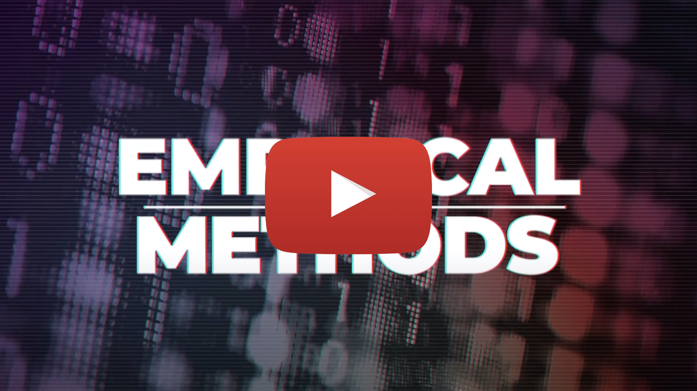

(thanks for the promo, [@JoshQuicksall](https://twitter.com/JoshQuicksall)!)

**This is the Spring 2021 offering of this course. For older versions, see here: [Fall 2018](https://bvasiles.github.io/empirical-methods/fall-2018).**

### Overview

Empirical methods play a key role in the design and evaluation of tools and technologies, and in testing the social and technical theories they embody. No matter what your research area is, chances are you will be conducing some empirical studies as 
part of your work. Are you looking to evaluate a new algorithm? New tool? 
Analyze (big) data? Understand what challenges practitioners face in some domain? 

This course is a survey of empirical methods designed for computer 
science PhD students, that teaches you how to go about each of these activities in a principled and rigorous way. You will learn about and get hands-on experience with a core of qualitative and quantitative empirical research methods, including interviews, 
qualitative coding, survey design, and many of the most useful statistical analyses of (large-scale) data, such as various forms of regression, time series analysis, and causal inference. And you will learn how to design valid studies applying and combining these methods.

There will be extensive reading with occasional student presentations about 
the reading in class, homework assignments, and a semester-long research 
project for which students must prepare in-class kickoff and final presentations 
as well as a final report.

After completing this course, you will:

-  become a more sophisticated consumer of empirical research, both in your field and outside
-  develop the methodological skills that can help you design and carry out empirical components in your own research program
-  be able to analyze empirical data, draw conclusions, and present results 
-  be able to read, summarize, present, but most importantly critique academic empirical research papers on a deep technical level

As a side effect, this course helps you develop a healthy dose of skepticism towards scientific results in general. Does the study design really allow the authors to make certain claims? Does the analysis technique? Is the evidence provided as strong as it could be? Are there fundamental flaws and threats to validity?

### Coordinates
- Lectures: Tuesdays & Thursdays 2:20-3:40pm, Eastern Time, on Zoom
- Assignments, private announcements: [Canvas](https://canvas.cmu.edu/courses/22393)
- Slides: this website
- Instructor: [Bogdan Vasilescu](https://bvasiles.github.io)

### Course Syllabus and Policies
The [syllabus](syllabus.md) covers course overview and objectives, evaluation, 
time management, late work policy, and collaboration policy.

### Learning Goals
The [learning goals](learning-goals.md) describe what I want students to know 
or be able to do by the end of the semester. 
I evaluate whether learning goals have been achieved through assignments, 
written project reports, and in-class presentations.

### Schedule

Below is a preliminary schedule for Spring 2021. Each link points to a dedicated page with materials and more details.
*Note*: The schedule is subject to change and will be updated as the semester progresses. 

| Date        		| Topic 	| Notes |
| :------------- 	|:--------|:-------- |
Tue, Feb 2 | [Introduction](pages/feb02-intro.md) | [slides](slides/01-intro.pdf) • [video](https://youtu.be/JdXipJ6xpgM)
Thu, Feb 4 | [Formulating research questions](pages/feb04-rqs.md) | [slides](slides/02-rqs.pdf) • [video](https://youtu.be/MNLXuDKzy4U)
Tue, Feb 9 | [The role of theory](pages/feb09-theory.md) | [slides](slides/03-theory.pdf) • [video](https://youtu.be/07O19aaKfU0)
Thu, Feb 11 | [Literature review](pages/feb11-litreview.md) | [slides](slides/04-litreview.pdf) • [video](https://youtu.be/vuUZYaJJVas)
Tue, Feb 16 | [Conducting interviews](pages/feb16-interviews.md) | [slides](slides/05-interviewing.pdf) • [video](https://youtu.be/G9v9wewVgt0)
Thu, Feb 18 | [Exemplar interview papers](pages/feb18-interviews-examples.md) | [slides](slides/06-interviewing-examples.pdf) • [video](https://youtu.be/NmCyLJQgUmA)
~~Tue, Feb 23~~ | ~~Break Day; No Classes~~ |
Thu, Feb 25 | [Qualitative data analysis](pages/feb25-coding.md) | [slides](slides/07-qualitative-coding.pdf) • [video](https://youtu.be/8YgYauoOnb0)
Tue, Mar 2 | [Survey design (part I)](pages/mar02-mar04-surveys.md) | [slides](slides/08-survey-design.pdf) • [video](https://youtu.be/xqkpjAVof6w)
Thu, Mar 4 | [Survey design (part II)](pages/mar02-mar04-surveys.md) | [slides](slides/08-survey-design.pdf) • [video](https://youtu.be/Rov8mTxTvW4)
Tue, Mar 9 | [Project proposal presentations](pages/mar09-proposals.md) | 
Thu, Mar 11 | [Numbers and nonsense](pages/mar11-numbers.md) | [slides](slides/10-experiments-pt1.pdf) • [video](https://youtu.be/HiCYuUUsa4A)
Tue, Mar 16 | [Causal relationships](pages/mar16-experiments.md) | [slides](slides/11-experiments-pt2.pdf) • [video](https://youtu.be/SzZXGtgdoV4)
Thu, Mar 18 | [Experimental design](pages/mar18-experiments-pt2.md) | [slides](slides/12-experiments-pt3.pdf) • [video](https://youtu.be/OfwR8W3xiec)
Tue, Mar 23 | [Intro to regression modeling](pages/mar23-regression-pt1.md) | [slides](slides/13-regression-pt1.pdf) • [video](https://youtu.be/thvgtVTiaDQ)
Thu, Mar 25 | [Linear regression diagnostics](pages/mar25-regression-pt2.md) | [slides](slides/14-regression-pt2.pdf) • [video](https://youtu.be/pq_wDYZPOKY)
Tue, Mar 30 | [Standardized coefficients + Mixed-effects](pages/mar30-regression-pt3.md) | [slides1](slides/15-zscore.html) • [slides2](slides/15-blr.html) • [video](https://youtu.be/rLoEDu9enQg)
Thu, Apr 1 | [Exemplar regression papers](pages/apr01-regression-examples.md) | [video](https://youtu.be/UK_n8YqH79I)
Tue, Apr 6 | [Simpson's paradox + Mixed-effects](pages/apr06-regression-pt5.md) | [slides](slides/17-mixed-effects.html)  • [video](https://youtu.be/PvHd_GqH6Tw)
Thu, Apr 8 | [Interrupted time series design](pages/apr08-its.md) | [slides](slides/18-its.pdf)  • [video](https://youtu.be/eryUi8jIDm4)
Tue, Apr 13 | Mixed-methods designs |
~~Thu, Apr 15~~ | ~~Spring Carnival; No Classes~~ |
Tue, Apr 20 | Big data vs thick data |
Thu, Apr 22 | Agree to disagree |
Tue, Apr 27 | Stepping up your paper production |
Thu, Apr 29 | Retrospective |
Tue, May 4 | Final presentations (part I) |
Thu, May 6 | Final presentations (part II) |

