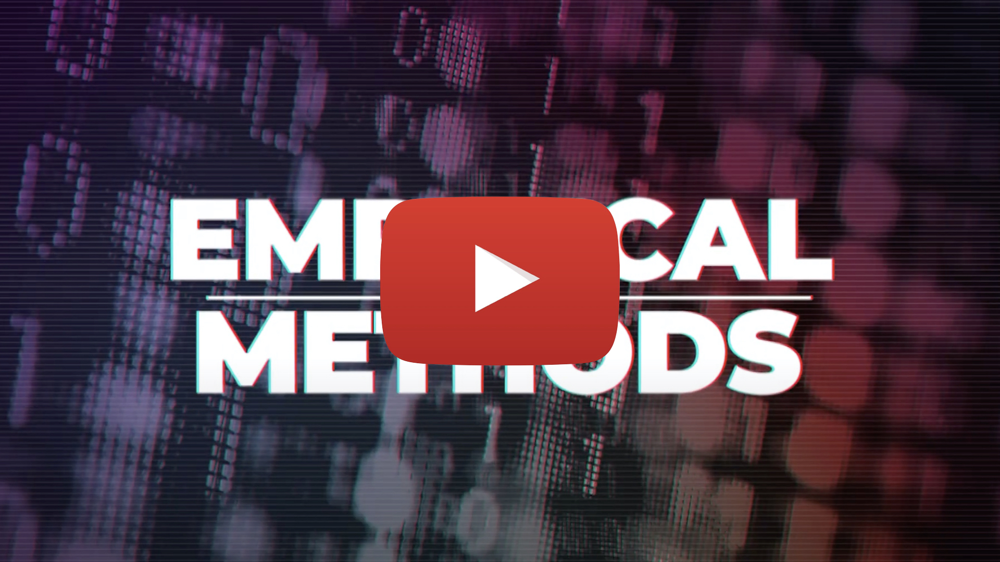

(thanks for the promo, [@JoshQuicksall](https://twitter.com/JoshQuicksall)!)

**This is the Spring 2026 offering of this course. For older versions, see here: [Spring 2024](spring-2024/) • [Fall 2022](fall-2022/) • [Spring 2021](spring-2021/) • [Fall 2018](fall-2018/).**

### Overview

Empirical methods play a key role in the design and evaluation of tools and technologies, 
and in testing the social and technical theories they embody. No matter what your 
research area is, chances are you will be conducting some empirical studies as 
part of your work. Are you looking to evaluate a new algorithm? New tool? 
Analyze (big) data? Understand what challenges practitioners face in some domain? 

This course is a survey of empirical methods designed primarily for computer 
science PhD students, that teaches you how to go about each of these activities 
in a principled and rigorous way. 
You will learn about and get hands-on experience with a core of qualitative and 
quantitative empirical research methods, including interviews, qualitative coding, 
survey design, and many of the most useful statistical analyses of (large-scale) 
data, such as various forms of regression, time series analysis, and causal inference. 
And you will learn how to design valid studies applying and combining these methods.

There will be extensive reading with occasional student presentations about 
the reading in class, homework assignments, and a semester-long research 
project for which students must prepare in-class kickoff and final presentations 
as well as a final report.

After completing this course, you will:

-  become a more sophisticated consumer of empirical research, both in your field and outside
-  develop the methodological skills that can help you design and carry out empirical components in your own research program
-  be able to analyze empirical data, draw conclusions, and present results 
-  be able to read, summarize, present, but most importantly critique academic empirical research papers on a deep technical level

As a side effect, this course helps you develop a healthy dose of skepticism towards scientific results in general. Does the study design really allow the authors to make certain claims? Does the analysis technique? Is the evidence provided as strong as it could be? Are there fundamental flaws and threats to validity?

### Coordinates
- Lectures: Tuesdays & Thursdays 3:30-4:50pm, Eastern Time in GHC 5222
- Assignments, private announcements: [Canvas](https://canvas.cmu.edu/courses/52575)
- Slides: this website
- Reading materials: [Shared Google Drive folder](https://drive.google.com/drive/folders/1lSOQlbw-cRmT47_itpIJkTZua_IASNgB?usp=sharing) accessible with CMU login
- Instructor: [Bogdan Vasilescu](https://bvasiles.github.io)
- Teaching assistant: [Claudia Mamede](https://claudiarmamede.github.io)

### Course Syllabus and Policies
The [syllabus](syllabus.md) covers course overview and objectives, evaluation, 
time management, late work policy, and collaboration policy.

### Learning Goals
The [learning goals](learning-goals.md) describe what I want students to know 
or be able to do by the end of the semester. 
I evaluate whether learning goals have been achieved through assignments, 
written project reports, and in-class presentations.

### Schedule

Below is a preliminary schedule for Spring 2026. Each link points to a dedicated page with materials and more details.
All videos are published on [this YouTube channel](https://www.youtube.com/channel/UCLgXNb6mCADXWjsPlPKExWA).

*Note*: The schedule is subject to change and will be updated as the semester progresses. 

| Date        		| Topic 	| Notes |
| :------------- 	|:--------|:-------- |
~~Tue, Jan 13~~ | ~~No class (Bogdan out)~~ | 
~~Thu, Jan 15~~ | ~~No class (Bogdan out)~~ | 
Tue, Jan 20 | [Introduction](pages/jan20-intro.md) | [slides](slides/01-intro.pdf) • [video](https://www.youtube.com/watch?v=RW0yF_zDeAw)
Thu, Jan 22 | [Formulating research questions](pages/jan22-rqs.md) | [slides](slides/02-rqs.pdf) • [video](https://www.youtube.com/watch?v=1SCM76VQqtM)
Tue, Jan 27 | [Literature review](pages/jan27-litreview.md)  | [slides](slides/03-litreview.pdf) • [video](https://www.youtube.com/watch?v=_ICF0A7o64I)
Thu, Jan 29 | [Role of Theory](pages/jan29-theory.md) | [slides](slides/04-theory.pdf) • [video](https://www.youtube.com/watch?v=WuSB9Px2Yp8)
Tue, Feb 3 | [Interviewing](pages/feb03-interviews.md) | [slides](slides/06-interviewing.pdf) • [video](https://www.youtube.com/watch?v=zJ5FkfqAdns)
Thu, Feb 5 | Paper discussion and presentation | 
Tue, Feb 10 | Qualitative data analysis | 
Thu, Feb 12 | In-class activity: qualitative coding & thematic analysis | 
Tue, Feb 17 | Qualitative analysis in the age of LLMs | 
Thu, Feb 19 | Types of errors in probability survey research | 
Tue, Feb 24 | Questionnaire design and multi-item scales | 
Thu, Feb 26 | Causal relationships and experimental design | 
~~Tue, Mar 3~~ | ~~Spring break, no class~~ |
~~Thu, Mar 5~~ | ~~Spring break, no class~~ |
Tue, Mar 10 | Experimental design papers | 
Thu, Mar 12 | Interaction effects | 
Tue, Mar 17 | Regression modeling diagnostics | 
Thu, Mar 19 | In-class activity: Galton families regression | 
Tue, Mar 24 | In-class activity: Simpson's paradox | 
Thu, Mar 26 | Interrupted time series design | 
Tue, Mar 31 | Interrupted time series analysis with control | 
Thu, Apr 2 | In-class activity: ITS with control | 
Tue, Apr 7 | Dealing with controversy | 
~~Thu, Apr 9~~ | ~~Carnival, no class~~ |
Tue, Apr 14 | Guest lecture (Bogdan @ICSE) | 
Thu, Apr 16 | Guest lecture (Bogdan @ICSE) | 
Tue, Apr 21 | Final presentations (I) | 
Thu, Apr 23 | Final presentations (II) |
