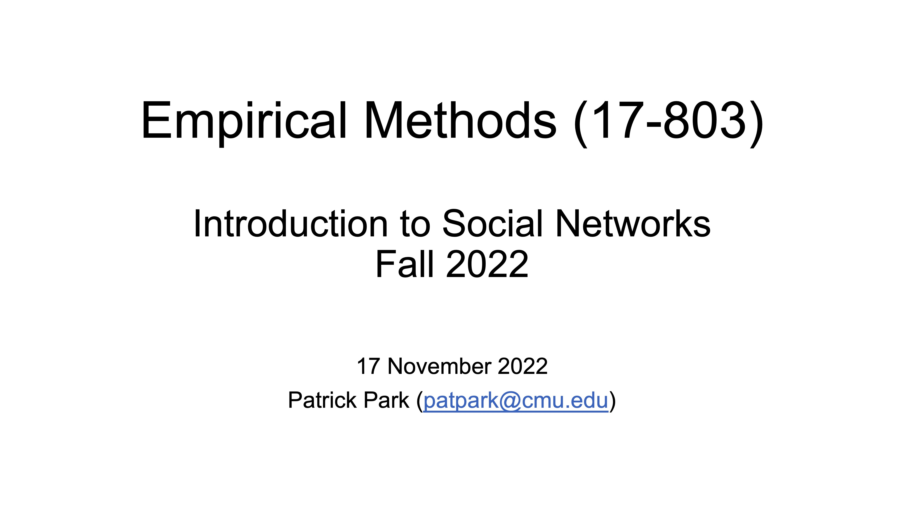

## L20: Intro to Social Network Analysis (Part II) ([pdf](../slides/20-social-networks-2.pdf), [video](https://youtu.be/LeRhO2QUZaU))

Why does Linux and the broader open-source ecosystem thrive despite weak economic incentives? Why do complex software systems sometimes fail despite being well-engineered? What makes a social media recommendation algorithm so effective and so toxic at the same time? Why do YouTube mega-influencers with tens of millions of subscribers exist, yet each of us can only recognize a handful at best? How do echo chambers and polarization emerge in social media platforms? How can you land your dream jobs? How does mass adoption of technological innovations happen? 

Underlying these seemingly unrelated questions is the powerful influence of social networks, the collection of on- and offline connections and dependencies that people and systems form with one another, often unknowingly.

This two-lecture series by guest [Prof. Patrick Park](https://patpark.org) offers a mini introduction to the study of social networks.

See also a [full course on Network Analysis](https://bvasiles.github.io/networks/) by Patrick and Bogdan.

### Lecture Readings

> Hidalgo, C. A. (2016). [Disconnected, fragmented, or united? a trans-disciplinary review of network science](https://link.springer.com/content/pdf/10.1007/s41109-016-0010-3.pdf). Applied Network Science, 1, 1-19.

---

> Borgatti, S. P., Mehra, A., Brass, D. J., & Labianca, G. (2009). [Network analysis in the social sciences](https://www.science.org/doi/full/10.1126/science.1165821). Science, 323(5916), 892-895. Chicago	

---

> Barabasi, Albert-Laszlo. 2016. [Network Science](http://networksciencebook.com). Cambridge.

Read Ch. 1 through Ch. 4. No need to do "Homework" sections.

---

> Granovetter, M. S. (1973). [The strength of weak ties](https://www.jstor.org/stable/pdf/2776392.pdf). American journal of sociology, 78(6), 1360-1380.

---

> Burt, R. S. (2004). [Structural holes and good ideas](https://www.journals.uchicago.edu/doi/abs/10.1086/421787). American Journal of Sociology, 110(2), 349-399.

---

> Backstrom, L., & Kleinberg, J. (2014). [Romantic partnerships and the dispersion of social ties: a network analysis of relationship status on Facebook](https://dl.acm.org/doi/pdf/10.1145/2531602.2531642). In Proceedings of the 17th ACM Conference on Computer Supported Cooperative Work & Social Computing (pp. 831-841). Chicago	

---

> Bearman, P. S., Moody, J., & Stovel, K. (2004). [Chains of affection: The structure of adolescent romantic and sexual networks](https://www.journals.uchicago.edu/doi/abs/10.1086/386272). American Journal of Sociology, 110(1), 44-91.
