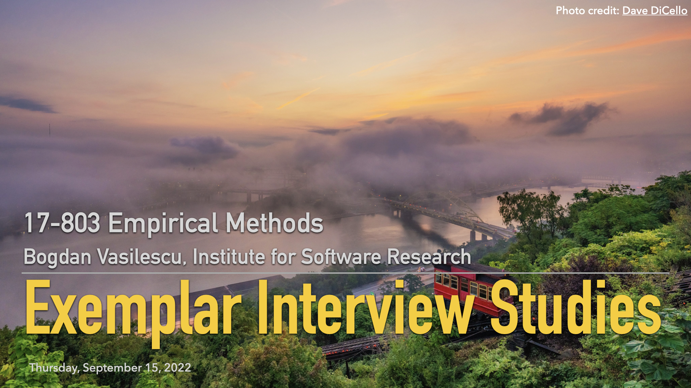

## L6: Interview Model Papers ([pdf](../slides/06-interviewing-examples.pdf), [video](https://youtu.be/7IXzoeohyLE))

In this lecture we continue our exploration of interviews by dissecting exemplar research papers that make good use of the qualitative interview method. We compare and contrast the type of research questions they ask; their overall study designs, including the role of interviews in those designs; and the specific steps part of their interview processes. Check out the slide deck for some observations on why these papers were great.

### Example Papers

> Singer, L., Figueira Filho, F., & Storey, M. A. (2014). [Software engineering at the speed of light: how developers stay current using Twitter](https://dl.acm.org/doi/pdf/10.1145/2568225.2568305). In Proceedings of the 36th International Conference on Software Engineering (ICSE) (pp. 211-221).

> Wash, R. (2010). [Folk models of home computer security](https://www.rickwash.com/papers/rwash-homesec-soups10-final.pdf). In Proceedings of the Sixth Symposium on Usable Privacy and Security (SOUPS) (pp. 1-16).

> Barwulor, C., McDonald, A., Hargittai, E., & Redmiles, E. M. (2021). “[Disadvantaged in the American-dominated internet”: Sex, Work, and Technology](https://files.osf.io/v1/resources/vzehu/providers/osfstorage/5f63a97211fb7c000f18f2c7?format=pdf&action=download&direct&version=2). In Proceedings of the 2021 ACM SIGCHI Conference on Human Factors in Computing Systems (CHI) (pp. 931-936).

> Aranda, J., & Venolia, G. (2009). [The secret life of bugs: Going past the errors and omissions in software repositories](https://ieeexplore.ieee.org/stamp/stamp.jsp?arnumber=5070530). In Proceedings of the 31st International Conference on Software Engineering (ICSE) (pp. 298-308).