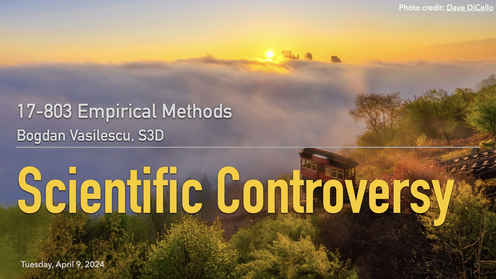

## L22: Dealing With Controversy ([slides](https://docs.google.com/presentation/d/1d_1DVGUHtDwZrFYAMnvI6A6s9BncsozjEpDlUt7cIn4/edit?usp=sharing), [video](https://youtu.be/ZKwkx03NrtE))

This was our last lecture before final presentations. We discussed, in this order, the popular Kahneman & Deaton happiness income threshold paper, the controversial paper by Killingsworth challenging the original result, and the amazing follow-up by both sets of authors resolving their earlier disagreements. What a great example to follow for how to handle scientific disagreements!

### Lecture Readings

> Kahneman, D., & Deaton, A. (2010). [High income improves evaluation of life but not emotional well-being](https://www.pnas.org/doi/epdf/10.1073/pnas.1011492107). Proceedings of the national academy of sciences, 107(38), 16489-16493.

---

> Killingsworth, M. A. (2021). [Experienced well-being rises with income, even above $75,000 per year](https://www.pnas.org/doi/pdf/10.1073/pnas.2016976118). Proceedings of the National Academy of Sciences, 118(4), e2016976118.

---

> Killingsworth, M. A., Kahneman, D., & Mellers, B. (2023). [Income and emotional well-being: A conflict resolved](https://www.pnas.org/doi/full/10.1073/pnas.2208661120). Proceedings of the National Academy of Sciences, 120(10), e2208661120.
