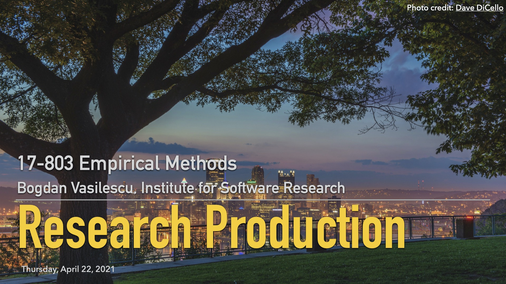

## L21: Research Production Process ([slides](../slides/21-research-production.pdf), [video](https://youtu.be/WsRU9zRopWk))

How to design beautiful graphics for your papers and beautiful slides for your talks? How to write (in LaTeX) without annoying your PhD advisor?

### Lecture Readings

> Atkinson, C., & Mayer, R. E. (2004). [Five ways to reduce PowerPoint overload](https://www.indezine.com/stuff/atkinsonmaye.pdf). Creative Commons, 1.

> Tufte, E. (2016). [The visual display of quantitative information](http://faculty.salisbury.edu/~jtanderson/teaching/cosc311/fa20/files/tufte.pdf) (1983). In Diagrammatik-Reader (pp. 219-230). De Gruyter (A).

> Tufte, E. R. (2006). [Beautiful evidence (Vol. 1)](http://atc.berkeley.edu/201/readings/Tufte_BE_2006.pdf). Cheshire, CT: Graphics Press.

