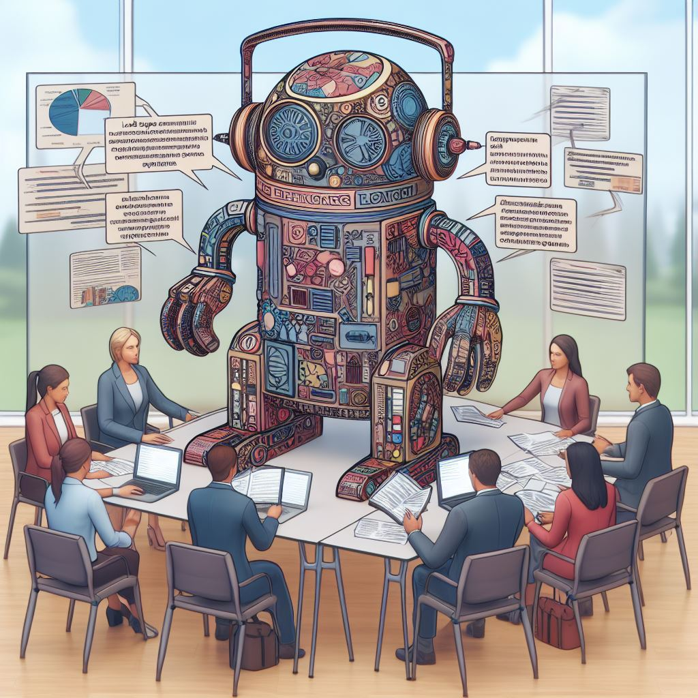

## L9: Qualitative Analysis with Large Language Models ([pdf](../slides/09-qualitative-coding-llms.pdf), video)

To what extent can we use large language models and chatbots for qualitative analysis of text? How much can we trust the results? And what prompting strategies are most effective? In this lecture we discuss the emerging literature on this topic.

### Lecture Readings

> Dunivin, Z. O. (2024). [Scalable Qualitative Coding with LLMs: Chain-of-Thought Reasoning Matches Human Performance in Some Hermeneutic Tasks](https://arxiv.org/pdf/2401.15170v1). arXiv preprint arXiv:2401.15170.
 
> Torii, M. G., Murakami, T., & Ochiai, Y. (2024). [Expanding Horizons in HCI Research Through LLM-Driven Qualitative Analysis](https://arxiv.org/pdf/2401.04138.pdf). arXiv preprint arXiv:2401.04138.
 
> Zhang, H., Wu, C., Xie, J., Lyu, Y., Cai, J., & Carroll, J. M. (2023). [Redefining qualitative analysis in the AI era: Utilizing ChatGPT for efficient thematic analysis](https://arxiv.org/pdf/2309.10771). arXiv preprint arXiv:2309.10771.

> Dengel, A., Gehrlein, R., Fernes, D., Görlich, S., Maurer, J., Pham, H. H., ... & Eisermann, N. D. G. (2023, October). [Qualitative Research Methods for Large Language Models: Conducting Semi-Structured Interviews with ChatGPT and BARD on Computer Science Education](https://www.mdpi.com/2227-9709/10/4/78). In Informatics (Vol. 10, No. 4, p. 78). MDPI. Chicago 
 
> Jalali, M. S., & Akhavan, A. (2024). [Integrating AI Language Models in Qualitative Research: Replicating Interview Data Analysis with ChatGPT](https://papers.ssrn.com/sol3/papers.cfm?abstract_id=4714998). Available at SSRN 4714998. Chicago	

> Liu, A., & Sun, M. (2023). [From Voices to Validity: Leveraging Large Language Models (LLMs) for Textual Analysis of Policy Stakeholder Interviews](https://www.amplifylearn.ai/wp-content/uploads/2023/12/2312.01202.pdf). arXiv preprint arXiv:2312.01202.

> Nguyen-Trung, K. [ChatGPT in Thematic Analysis: Can AI become a research assistant in qualitative research?](https://www.researchgate.net/profile/Kien-Nguyen-Trung/publication/377752239_ChatGPT_in_Thematic_Analysis_Can_AI_become_a_research_assistant_in_qualitative_research/links/65b63d5579007454973ec6f7/ChatGPT-in-Thematic-Analysis-Can-AI-become-a-research-assistant-in-qualitative-research.pdf).
