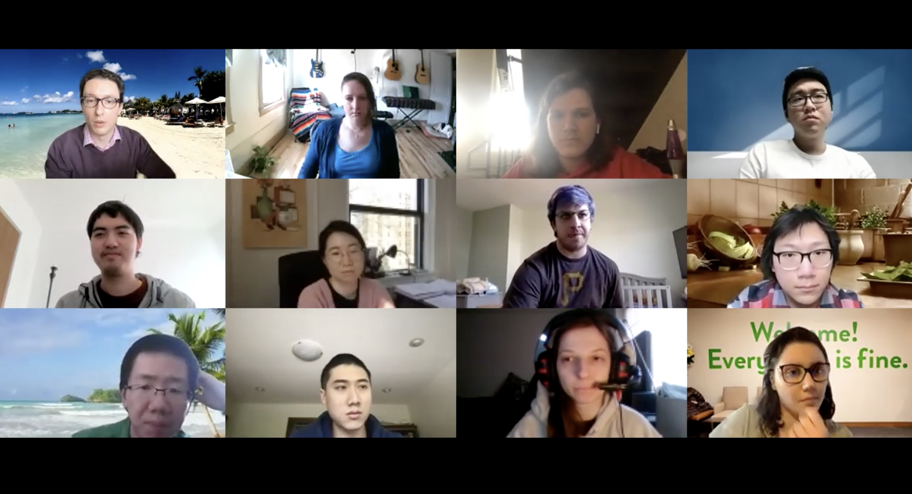

## L10: Research Project Proposals (no instructor slides; [video-part1](https://youtu.be/tAmFJ9MaRXk), [video-part2](https://youtu.be/9J2jgVeoda8), [video-part3](https://youtu.be/2KK5pxjOTi4))

In this lecture the students presented their cool research project proposals and we all critiqued each other's study designs.

Here are everyone's slides:
- Austin, [Is Cyber Deception Worth It?](../slides/proposals/austin.pdf)
- Ben, [Exploring the Efficacy of Scenario-based Testing in Autonomous Vehicle Systems](../slides/proposals/ben.pdf)
- Hana, [Being Trans in OSS](../slides/proposals/hana.pdf)
- Hongbo, [Innovation in Open Source Software](../slides/proposals/hongbo.pdf)
- Jae Yeon, [Retail Investors' Use of Accounting Information in Investment Decision Making](../slides/proposals/jaeyeon.pdf)
- Jenna, [Empirically Evaluating Gradual Verification](../slides/proposals/jenna.pdf)
- Jeremy, [Decompiler Understandability Study](../slides/proposals/jeremy.pdf)
- Kyle, [TickTalk – Language Design for Large-Scale IoT Apps](../slides/proposals/kyle.pdf)
- Nadia, [Collaboration Challenges in Building Production Machine Learning Systems](../slides/proposals/nadia.pdf)
- Sam, [Diversity-Innovation Paradox in Open-Source Software](../slides/proposals/sam.pdf)
- Simon & CJ, [ROS Security Project](../slides/proposals/simon_cj.pdf)

