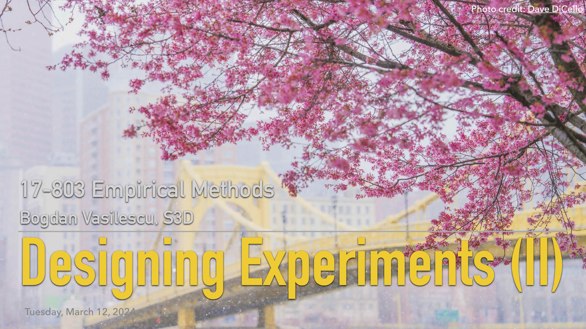

## L14: Experimental Design Part II - Examples ([pdf](../slides/14-experiments-pt2.pdf), [video]())

This lecture is the second part of a series on designing experiments. 

We discussed and critiqued examples of studies using experiments, including a true (randomized) experiment in the Tomkins et al study of double blind reviewing at the Conference on Web Search and Data Mining.

### Lecture Readings

> Shadish, W. R., Cook, T. D., & Campbell, D. T. (2002). Experimental and quasi-experimental designs for generalized causal inference. Wadsworth Publishing.

The discussion of cause as an *inus condition* -- "insufficient but nonredundant part of an unnecessary but sufficient condition" -- follows Chapter 1 from the book (Experiments and generalized causal inference).

---

> Tomkins, A., Zhang, M., & Heavlin, W. D. (2017). [Single versus double blind reviewing at WSDM 2017](https://arxiv.org/pdf/1702.00502). arXiv preprint arXiv:1702.00502

A nice example of a randomized experiment carried out to assess the impact of single vs double-blind reviewing of conference papers. The paper reports that: 
- “Reviewers in the single-blind condition [...] preferentially bid for papers from top universities and companies.”
- “Single-blind reviewers are significantly more likely than their double-blind counterparts to recommend for acceptance papers from famous authors [odds multiplier 1.64], top universities [1.58], and top companies [2.10].”

