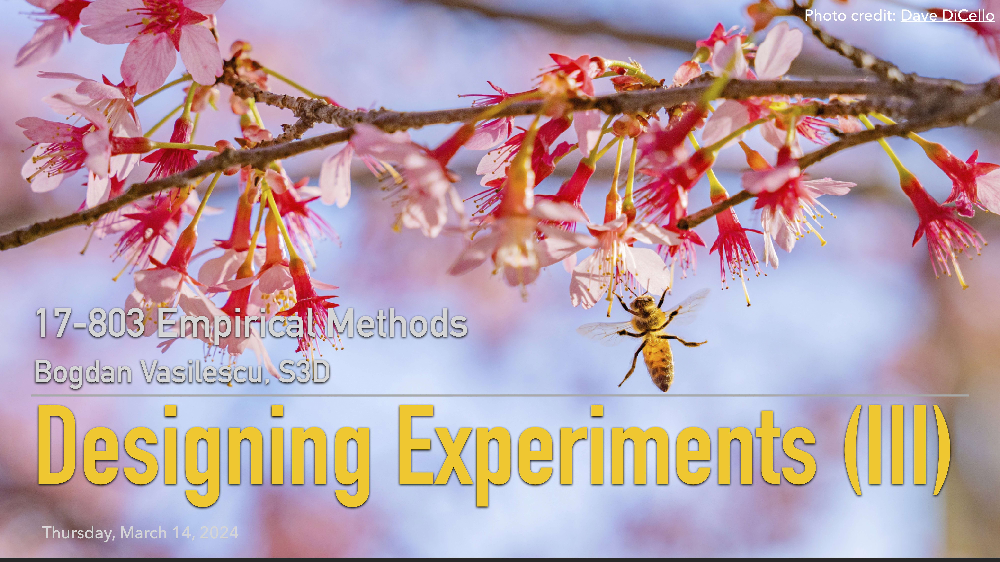

## L15: Experimental Design Part III - Stats ([pdf](../slides/15-experiments-pt3.pdf))

This lecture is the third and final part of a series on designing experiments. We discussed factorial design and regression models to tease out interaction effects, as well as power analysis.

The two R markdown notebooks we went through are in the [Shared Google Drive folder](https://drive.google.com/drive/folders/1lSOQlbw-cRmT47_itpIJkTZua_IASNgB?usp=sharing) accessible with CMU login.

In the slide deck see also the discussion of four types of threats to validity (statistical conclusion validity, internal validity, construct validity, and external validity). This is particularly important as many of the threats apply also to other research methods.

### Lecture Readings

> Shadish, W. R., Cook, T. D., & Campbell, D. T. (2002). Experimental and quasi-experimental designs for generalized causal inference. Wadsworth Publishing.

- Chapter 1: Experiments and generalized causal inference 
- Chapter 2: Statistical conclusion validity and internal validity 
- Chapter 3: Construct validity and external validity
- Chapter 8: Randomized experiments

The book goes into great depth about the different experiment designs commonly used with random assignment and the different types of threats to validity.

---

> Lazar, J., Feng, J. H., & Hochheiser, H. (2017). [Research methods in human-computer interaction](https://www.elsevier.com/books/research-methods-in-human-computer-interaction/lazar/978-0-12-805390-4). Morgan Kaufmann.

- Chapter 3: Experimental design 
- Chapter 4: Statistical analysis

Chapter 3 focuses on the design of true experiments (participants are randomly assigned to different conditions). Three major types of experiment design are discussed: between-group design, within-group design, and split-plot design. The chapter also covers potential sources of systematic errors (biases) and guidelines for effectively avoiding or controlling those biases. 

Chapter 4 discusses general data analysis procedures and commonly used statistical methods, including independent-samples t test, paired-samples t test, one-way analysis of variance (ANOVA), factorial ANOVA, repeated measures ANOVA, correlation, regression, chi-squared test, and four other nonparametric tests. The focus is not on the mathematical computation behind each method, but rather on the contexts of use and the assumptions of each method. They also discuss how to appropriately interpret the results of each significance test.

---

> Goodman, S. (2008). [A dirty dozen: Twelve p-value misconceptions](http://www.ohri.ca/newsroom/seminars/SeminarUploads/1829%5CSuggested%20Reading%20-%20Nov%203,%202014.pdf). In Seminars in Hematology (Vol. 45, No. 3, pp. 135-140). WB Saunders.

Among others, the paper addresses a common false belief that the probability of a conclusion being in error can be calculated from the data in a single experiment without reference to external evidence or the plausibility of the underlying mechanism.

### Additional Readings

> MacKenzie, I. S. (2012). [Human-computer interaction: An empirical research perspective](https://itsciencetech.files.wordpress.com/2015/12/i-_scott_mackenzie_human-computer_interaction_abookzz-org.pdf).

- Chapter 5: Designing HCI experiments
- Chapter 6: Hypothesis testing

Chapter 5 covers experiment design through a signal and noise metaphor. In the metaphor, we divide our observations and measurements into two components: signal and noise. In experiments, the signal is related to a variable of interest. The noise is everything else — the random influences. The process of designing an experiment is one of enhancing the signal while reducing the noise. This is done by carefully considering the setup of the experiment in terms of the variables manipulated and measured, the variables controlled, the procedures, the tasks, and so on. Collectively, these properties of an experiment establish the methodology for the research. I found the section on "order effects, counterbalancing, and latin squares" particularly useful.

Chapter 6 describes a few useful statistical tools and techniques as they are typically used in HCI research. The emphasis is on practical value instead of theory. 

---

> Robertson, J., & Kaptein, M. (Eds.). (2016). [Modern statistical methods for HCI](https://www.springer.com/gp/book/9783319266312). Cham: Springer.
- Chapter 5: Effect sizes and power analysis
- Chapter 13: Fair statistical communication
- Chapter 14: Improving statistical practice

Chapter 5 focuses on null hypothesis significance testing (NHST) -- a common statistical analysis method in empirical research. The chapter discusses common misunderstandings of NHST and p-value, and how effect sizes can complement them. Methods for calculating effect sizes are included together with examples. Power analysis is also discussed. 

Chapter 13 explains in a non-technical manner why it would be beneficial for empirical researchers to switch to an estimation approach, i.e., reporting informative charts with effect sizes and interval estimates, instead of p-values and dichotomous testing procedures. Advice is offered on how to communicate empirical research results in a clear, accurate, and transparent way without using any tests or p-values.

Chapter 14 includes a series of recommendations to authors, reviewers, and editors for improving the quality of statistical methodology and reporting in empirical research.

---

> Kaptein, M., & Robertson, J. (2012). [Rethinking statistical analysis methods for CHI](http://citeseerx.ist.psu.edu/viewdoc/download?doi=10.1.1.457.1928&rep=rep1&type=pdf). In Proceedings of the SIGCHI Conference on Human Factors in Computing Systems (pp. 1105-1114).

The paper reflects critically on the appropriateness of a significance testing approach to statistical analysis when testing hypotheses and the use of routine interpretation of results using “canned” p values. Three problems with current practice are discussed: the fallacy of the transposed conditional, a neglect of power, and the reluctance to interpret the size of effects.

---

> Rosenberg, J. (2008). [Statistical methods and measurement](http://www.cin.ufpe.br/~fmcf2/Doutorado/2008-Guide%20to%20Advanced%20Empirical%20Software%20Engineering.pdf#page=161). In Guide to Advanced Empirical Software Engineering (pp. 155-184). Springer, London.

Useful ways of measuring software engineering phenomena have to address two challenges: defining realistic and valid metrics that can feasibly be collected under the constraints and time pressures of real-world software development contexts, and determining valid and accurate ways of analyzing the resulting data to guide decisions. Too often, the difficulties of addressing the first challenge mean that the second is given little attention. The purpose of this chapter is to present different techniques for the definition and analysis of metrics such as product quality data. Specifically, statistical issues in the definition and application of metrics are presented with reference to software engineering examples.

---

> Wohlin, C., Runeson, P., Höst, M., Ohlsson, M. C., Regnell, B., & Wesslén, A. (2012). [Experimentation in software engineering](https://www.springer.com/gp/book/9783642290435). Springer Science & Business Media.

Chapter 10 (Analysis and interpretation) discusses quantitative interpretation of software engineering data. 
In the first step, the data is characterized using descriptive statistics, which visualize central tendency, dispersion, etc. In the second step, abnormal or false data points are excluded, thus reducing the data set to a set of valid data points. In the third step, the data is analyzed by hypothesis testing, where the hypotheses of the experiment are evaluated statistically, at a given level of significance. 

---

The following are great introductory materials into statistics and data science:

> Bruce, P., Bruce, A., & Gedeck, P. (2020). [Practical Statistics for Data Scientists: 50+ Essential Concepts Using R and Python](https://github.com/gedeck/practical-statistics-for-data-scientists). O'Reilly Media.

> Freedman, D., Pisani, R., & Purves, R. (2007). [Statistics](https://wwnorton.com/books/9780393929720). W. W. Norton & Company.

---

