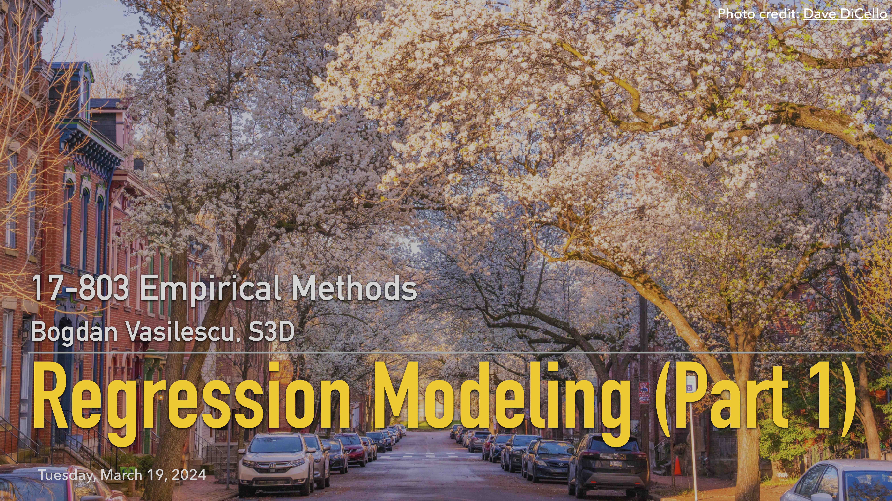

## L16: Intro to Linear Regression ([pdf](../slides/16-regression-pt1.pdf), [video](https://youtu.be/B0EWuMce3vY))

This is the first lecture in a series dedicated to regression modeling. We talked about simple / multiple linear regression and how standard errors can be used to perform hypothesis tests on the estimated coefficients, with many examples throughout. I also showed a few bits from [this R notebook](../assets/activities/zscore.pdf).

The importance of having a good understanding of linear regression before studying more complex statistical models cannot be overstated.

### Lecture Readings

> James, G., Witten, D., Hastie, T., & Tibshirani, R. (2013). [An introduction to statistical learning](https://www.academia.edu/download/60707896/An_Introduction_to_Statistical_Learning_with_Applications_in_R-Springer_201320190925-63943-2cqzhk.pdf) (Vol. 112, p. 18). Springer.

Chapter 3 reviews some of the key ideas underlying the linear regression model, as well as the least squares approach that is most commonly used to fit this model.

---

> Grolemund, G., & Wickham, H. (2018). [R for data science](https://r4ds.had.co.nz/index.html).

This book will teach you how to do data science with R: You’ll learn how to get your data into R, get it into the most useful structure, transform it, visualise it, and model it. In this book, you will find a practicum of skills for data science. Just as a chemist learns how to clean test tubes and stock a lab, you’ll learn how to clean data and draw plots—and many other things besides. 

Chapters 22-24 (Modeling) are the most relevant for this lecture.

---

> Bruce, P., Bruce, A., & Gedeck, P. (2020). [Practical Statistics for Data Scientists: 50+ Essential Concepts Using R and Python](https://github.com/gedeck/practical-statistics-for-data-scientists). O'Reilly Media.

Chapter 4 covers regression modeling. Note the emphasis on prediction, instead of the more common goal of explanation in empirical research.

---

> Goodman, S. (2008). [A dirty dozen: Twelve p-value misconceptions](http://www.ohri.ca/newsroom/seminars/SeminarUploads/1829%5CSuggested%20Reading%20-%20Nov%203,%202014.pdf). In Seminars in Hematology (Vol. 45, No. 3, pp. 135-140). WB Saunders.

Among others, the paper addresses a common false belief that the probability of a conclusion being in error can be calculated from the data in a single experiment without reference to external evidence or the plausibility of the underlying mechanism.

### Additional Readings

> Woolridge, J. M. (2003). [Introductory econometrics: A modern approach](http://repository.fue.edu.eg/xmlui/bitstream/handle/123456789/2774/7831.pdf). Thomson, Mason. 

Probably the most in-depth coverage of regression modeling possible. More emphasis on theory than other sources.

---

> F.E. Harrell, Jr., [Regression Modeling Strategies](http://hbiostat.org/doc/rms.pdf), Springer Series in Statistics. 
- Chapter 1: Introduction
- Chapter 2: General aspects of fitting regression models (especially 2.1–2.3, 2.7)
- Chapter 4: Multivariable modeling strategies

---

> Freedman, D., Pisani, R., & Purves, R. (2007). [Statistics](https://wwnorton.com/books/9780393929720). W. W. Norton & Company.

