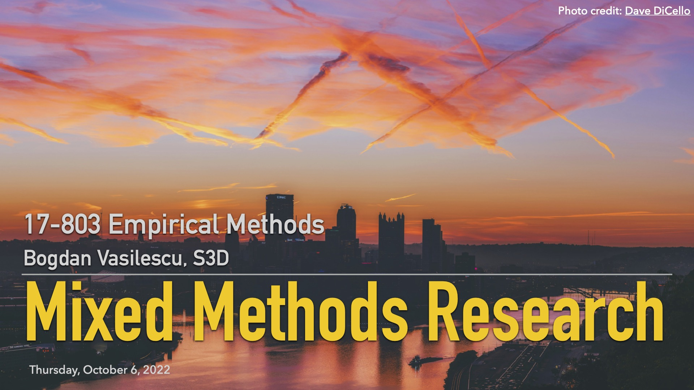

## L10: Mixed Methods ([slides](../slides/10-mixed-methods.pdf), [video](https://youtu.be/jzjjhUwocrM))

All methods have limitations. However, there are scenarios when the strengths of one method can compensate the weaknesses of other methods, when combined in a mixed methods / multi-methodology design.

Multi-methodology and mixed methods research studies use two or more approaches to data collection or analysis to corroborate, complement and expand research findings (multi-methodology) or combine and integrate inductive research with deductive research (mixed methods), often but not necessarily relying on qualitative and/or quantitative data.

In this lecture we discuss three common strategies for mixed methods empirical research design (sequential explanatory, sequential exploratory, and concurrent triangulation), the draft of the newly proposed [standard](https://github.com/margaretstorey/mixed-methods) for evaluating mixed methods and multi-methodology software engineering studies, and a few examples of studies illustrating the tree strategies.

### Example Papers

> Greiler, M., Deursen, A. V., & Storey, M. A. (2012). [Test confessions: a study of testing practices for plug-in systems](https://www.michaelagreiler.com/wp-content/uploads/2020/03/TUD-SERG-2011-010-Test-Confessions.pdf). In Proceedings of the 34th International Conference on Software Engineering (pp. 244-254). IEEE.

> Mamykina, L., Manoim, B., Mittal, M., Hripcsak, G., & Hartmann, B. (2011). [Design lessons from the fastest Q&A site in the West](http://bid.berkeley.edu/files/papers/mamykina-stackoverflow-chi2011.pdf). In Proceedings of the SIGCHI Conference on Human factors in Computing Systems (pp. 2857-2866). ACM.

> Watt, M. H., Myers, B., Towe, S. L., & Meade, C. S. (2015). [The Mental Health Experiences and Needs of Methamphetamine Users in Cape Town: a Mixed-Methods Study](https://www.ajol.info/index.php/samj/article/view/127026/116544). South African Medical Journal, 105(8), 685-688.

### Lecture Readings

> Margaret-Anne Storey (University of Victoria). [Multi-Methodology and Mixed Methods Research](https://github.com/margaretstorey/mixed-methods).
Supplement to the SIGSOFT Standards. 

The draft of the proposed SIGSOFT standard for evaluating mixed methods / multi-methodology empirical software engineering research.

--- 

> [Chapter 10 ("Mixed Methods Procedures")](https://www.homeworkmarket.com/files/creswell2014mixedmethodsprocedures.pdf) from Creswell, J. W., & Creswell, J. D. (2017). Research design: Qualitative, quantitative, and mixed methods approaches. Sage publications.

> Creswell, John W., V. L. Plano Clark, Michelle L. Gutmann, and William E. Hanson. ["An expanded typology for classifying mixed methods research into designs."](https://us.corwin.com/sites/default/files/upm-binaries/19291_Chapter_7.pdf) A. Tashakkori y C. Teddlie, Handbook of mixed methods in social and behavioral research (2003): 209-240.

Creswell et al is THE canonical reference on mixed-methods research design. The two chapters are both relevant (there is overlap between them). They describe the three strategies above in detail, plus some others, less commonly encountered in empirical CS.

---

> Easterbrook, Steve, Janice Singer, Margaret-Anne Storey, and Daniela Damian. ["Selecting empirical methods for software engineering research."](http://maveric0.uwaterloo.ca/~migod/846/papers/easterbrookChapter.pdf) In Guide to advanced empirical software engineering, pp. 285-311. Springer, London, 2008.

We used the Easterbrook et al chapter before. It also includes a brief overview of mixed methods research designs, mostly following Creswell.

### Additional Readings

> Johnson, R. & Onwuegbuzie, Anthony & Turner, Lisa. (2007). [Toward a Definition of Mixed Methods Research. Journal of Mixed Methods Research](https://citeseerx.ist.psu.edu/viewdoc/download?doi=10.1.1.531.3967&rep=rep1&type=pdf), 1, 112-133. Journal of Mixed Methods Research. 1. 112 -133. 10.1177/1558689806298224.

The paper gives a broad overview of what mixed methods research is and how it came to become "one of the three major 'research paradigms' (quantitative research, qualitative research, and mixed methods research)." 

---

> Venkatesh, V., Brown, S. A., & Bala, H. (2013). [Bridging the qualitative-quantitative divide: Guidelines for conducting mixed methods research in information systems](http://site.iugaza.edu.ps/kdahleez/files/2014/02/44-BRIDGING-THE-QUALITATIVE-QUANTITATIVE-DIVIDE-GUIDELINES-FOR-CONDUCTING-MIXED-METHODS-RESEARCH-IN-INFORMATION-SYSTEMS-2013.pdf). MIS Quarterly, 21-54.

The paper elaborates on three important aspects of conducting mixed methods research: (1) appropriateness of a mixed methods approach; (2) development of meta-inferences (i.e., substantive theory) from mixed methods research; and (3) assessment of the quality of meta-inferences (i.e., validation of mixed methods research). 

--- 

See also [the references suggested by Peggy Storey](https://github.com/margaretstorey/mixed-methods/blob/main/mixed-methods.md#suggested-readings-in-progress).