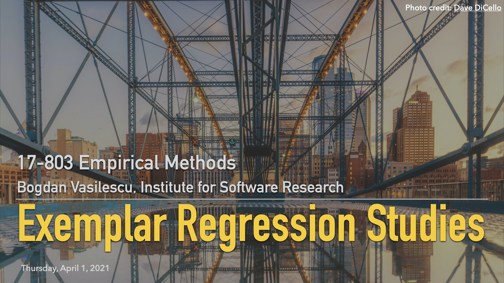

## L16: Regression Model Papers ([video](https://youtu.be/UK_n8YqH79I))

In this lecture we continue our exploration of regression modeling by dissecting three exemplar research papers that make good use of regression modeling (plus two more papers in the [next lecture](apr06-regression-pt5.md)). We compare and contrast the type of research questions they ask; their overall study designs, including the role of regression in those designs; and the specific steps part of their modeling processes. 

### Example Papers

We discussed the first three in this lecture and the remaining two in the [next lecture](apr06-regression-pt5.md).

> Biddle, S., & Long, S. (2004). [Democracy and military effectiveness: A deeper look](https://citeseerx.ist.psu.edu/viewdoc/download?doi=10.1.1.565.9215&rep=rep1&type=pdf). Journal of Conflict Resolution, 48(4), 525-546.

> Lim, S. (2009). [How and why do college students use Wikipedia?](https://www.academia.edu/download/41008816/how_and_why_do_college_students_use_wikipedia.pdf). Journal of the American Society for Information science and Technology, 60(11), 2189-2202.

> Bird, C., Nagappan, N., Devanbu, P., Gall, H., & Murphy, B. (2009). [Does distributed development affect software quality? An empirical case study of Windows Vista](https://www.ifi.uzh.ch/seal/teaching/courses/archive/FS13/SWEvo13/bird2009.pdf). In 2009 IEEE 31st International Conference on Software Engineering (pp. 518-528). IEEE.

> Peoples, B. K., Midway, S. R., Sackett, D., Lynch, A., & Cooney, P. B. (2016). [Twitter predicts citation rates of ecological research](https://journals.plos.org/plosone/article/file?id=10.1371/journal.pone.0166570&type=printable). PloS One, 11(11), e0166570.

> Vasilescu, B., Posnett, D., Ray, B., van den Brand, M. G., Serebrenik, A., Devanbu, P., & Filkov, V. (2015). [Gender and tenure diversity in GitHub teams](https://cmustrudel.github.io/papers/chi15.pdf). CHI Conference on Human Factors in Computing Systems, CHI, ACM, pp 3789–3798. See also [this erratum](https://dl.acm.org/action/downloadSupplement?doi=10.1145%2F2702123.2702549&file=chi2015erratum.pdf).
