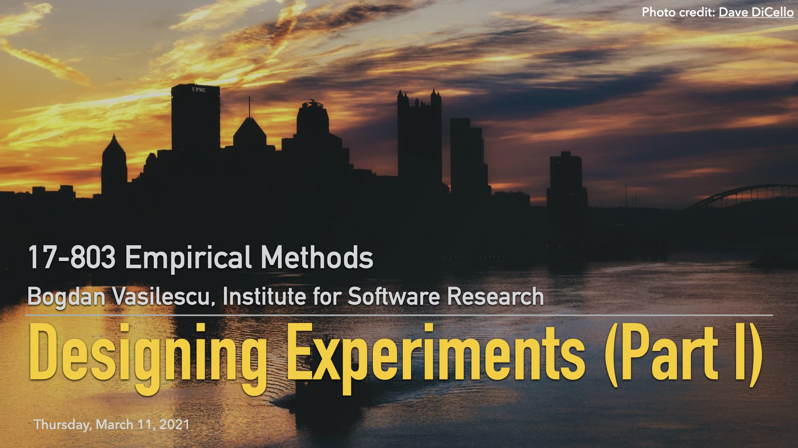

## L10: Numbers and Nonsense ([pdf](../slides/10-experiments-pt1.pdf), [video](https://youtu.be/HiCYuUUsa4A))

A mathematician, an engineer, and a data scientist are applying for a job. They are led to the interview room and given a math quiz. The first problem is a warm-up: What is 2 + 2? The mathematician rolls her eyes, writes the numeral 4, and moves on. The engineer pauses for a moment, then writes "Approximately 4." The data scientist looks around nervously, then gets out of his chair and walks over to the fellow administering the test. "Before I put anything in writing," he says in a low whisper, "what do you want it to be?"

Data can help us understand the world based upon hard evidence, but hard numbers are a lot softer than one might think. Numbers feel objective, but are easily manipulated to tell whatever story one desires. Words are clearly constructs of human minds, but numbers? Numbers seem to come directly from Nature herself. We know words are subjective. We know they are used to bend and blur the truth. Words suggest intuition, feeling, and expressivity. But not numbers. Numbers suggest precision and imply a scientific approach. Numbers appear to have an existence separate from the humans reporting them.
[Excerpt From: Bergstrom, C. T., & West, J. D. (2020). "Calling Bullshit: The Art of Skepticism in a Data-Driven World." Random House.]

This lecture is the first part of a series on designing experiments and marks the transition towards more quantitative research methods in our course. Before diving deeper into causal relationships and different experiment designs, we start with some examples meant to remind our inner skeptics to take everything, even numbers, with a grain of salt. 

### Lecture Readings

> Bergstrom, C. T., & West, J. D. (2020). [Calling Bullshit: The Art of Skepticism in a Data-Driven World](https://www.penguinrandomhouse.com/books/563882/calling-bullshit-by-carl-t-bergstrom-and-jevin-d-west/). Random House.

Wonderful book and [course at University of Washington](https://www.callingbullshit.org), designed to teach people how to think critically about the data and models that constitute evidence in the social and natural sciences.
The lecture draws heavily from chapters 5 (Numbers and Nonsense) and 6 (Selection Bias).

### Additional Readings

> Huff, D. (1993). [How to lie with statistics](https://towardsdatascience.com/lessons-from-how-to-lie-with-statistics-57060c0d2f19). WW Norton & Company.

The book is one of the best-selling statistics books in history! It's a brief, breezy illustrated volume outlining the misuse of statistics and errors in the interpretation of statistics, and how these errors may create incorrect conclusions.

Themes of the book include "Correlation does not imply causation" and "Using random sampling". It also shows how statistical graphs can be used to distort reality, for example by truncating the bottom of a line or bar chart, so that differences seem larger than they are, or by representing one-dimensional quantities on a pictogram by two- or three-dimensional objects to compare their sizes, so that the reader forgets that the images do not scale the same way the quantities do.