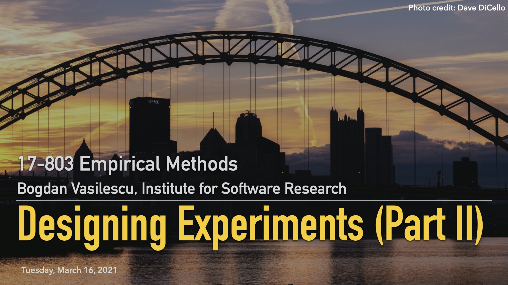

## L11: Causal Relationships ([pdf](../slides/11-experiments-pt2.pdf), [video](https://youtu.be/SzZXGtgdoV4))

This lecture is the second part of a series on designing experiments. We discussed what it means for something to be a "cause" or an "effect," the three ingredients needed for establishing a causal relationship, and how experiments as a research method match the characteristics of causal relationships very well.

We also discussed and critiqued two example studies using experiments: a true (randomized) experiment in the Tomkins et al study of double blind reviewing at the Conference on Web Search and Data Mining, and a quasi-experiment in the Sobel & Clarkson study of teaching formal methods.

### Lecture Readings

> Shadish, W. R., Cook, T. D., & Campbell, D. T. (2002). Experimental and quasi-experimental designs for generalized causal inference. Wadsworth Publishing.

The discussion of cause as an *inus condition* -- "insufficient but nonredundant part of an unnecessary but sufficient condition" -- follows Chapter 1 from the book (Experiments and generalized causal inference).

---

> Sobel, A. E. K., & Clarkson, M. R. (2002). [Formal methods application: An empirical tale of software development](https://ieeexplore.ieee.org/abstract/document/991322/). IEEE Transactions on Software Engineering, 28(3), 308-320.

> Berry, D. M., & Tichy, W. F. (2003). [Comments on “Formal methods application: an empirical tale of software development"](http://citeseerx.ist.psu.edu/viewdoc/download?doi=10.1.1.513.1241&rep=rep1&type=pdf). IEEE Transactions on Software Engineering, 29(6), 567-571.

> Sobel, A. E. K., & Clarkson, M. R. (2003). [Response to “Comments on ‘Formal methods application: an empirical tale of software development’”](http://citeseerx.ist.psu.edu/viewdoc/download?doi=10.1.1.516.409&rep=rep1&type=pdf). IEEE Transactions on Software Engineering, 29(6), 572-575.

A rare example of an academic feud about the validity of study design, that played out in public. Read the papers in the order they are listed above. The second paper is a critique of the original study design, with a response by the original authors in the third paper.

---

> Tomkins, A., Zhang, M., & Heavlin, W. D. (2017). [Single versus double blind reviewing at WSDM 2017](https://arxiv.org/pdf/1702.00502). arXiv preprint arXiv:1702.00502

A nice example of a randomized experiment carried out to assess the impact of single vs double-blind reviewing of conference papers. The paper reports that: 
- “Reviewers in the single-blind condition [...] preferentially bid for papers from top universities and companies.”
- “Single-blind reviewers are significantly more likely than their double-blind counterparts to recommend for acceptance papers from famous authors [odds multiplier 1.64], top universities [1.58], and top companies [2.10].”

